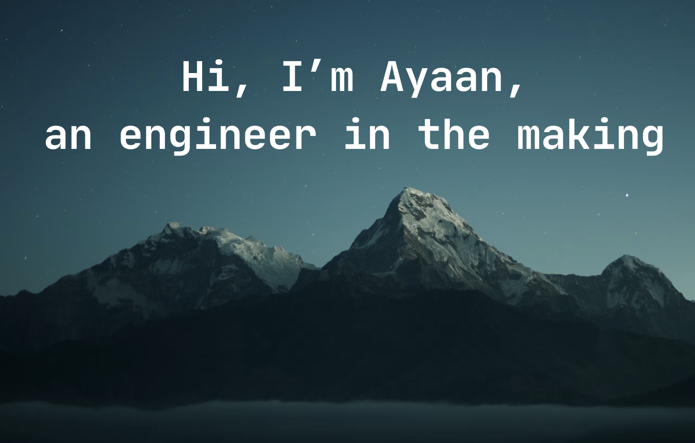

I'm a Computer Science student at UIUC who likes building fast systems and useful AI products. I enjoy taking an idea from an early prototype to something people can actually use.

### 🚀 Projects

- **[AstraExchange](https://github.com/recalculator/AstraExchange)** — A C++ order-matching engine built for speed.
- **[JavaDB](https://github.com/recalculator/JavaDB)** — A database engine with a B+ tree index, write-ahead logging, and crash recovery.
- **[Lexora](https://github.com/recalculator/lexora)** — A contract analysis app that flags risky clauses and suggests negotiation strategies.
- **[ADS-B Flight Pipeline](https://github.com/recalculator/adsb-flight-pipeline)** — Live aircraft tracking from radio signals to a real-time dashboard.

### 🛠️ What I work with

**Languages:** Python, C++, Java, TypeScript  
**Tools:** React, Next.js, FastAPI, PostgreSQL, Docker, PyTorch

### 📫 Find me

[Website](https://ayaanchawla.me/) · [Email](mailto:ayaan.chawla@gmail.com)
